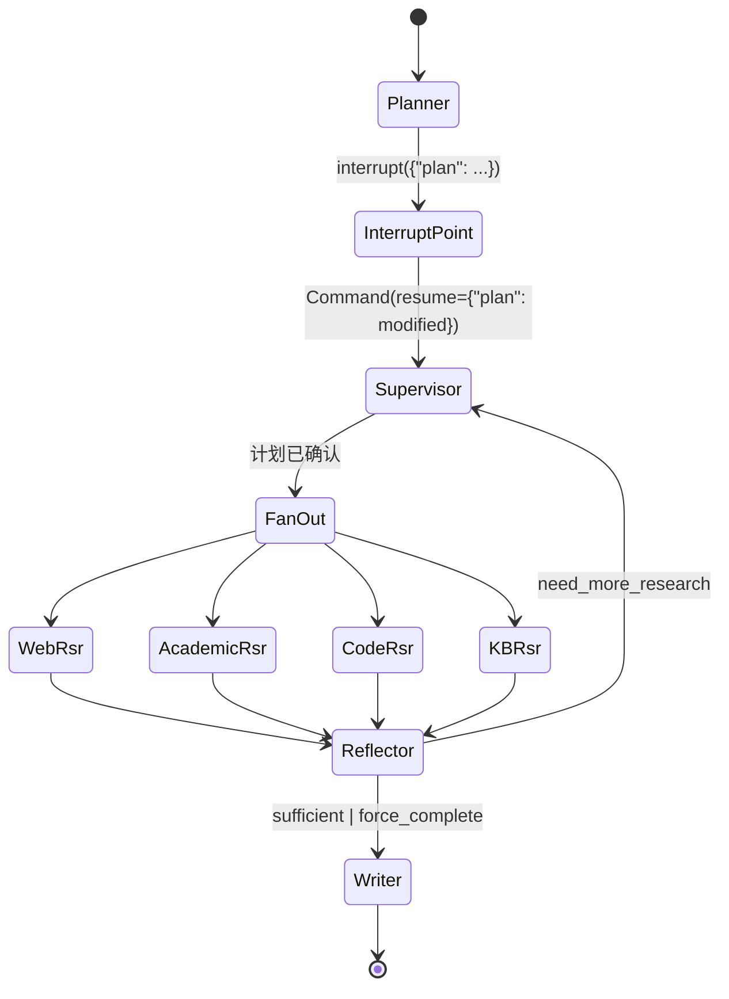
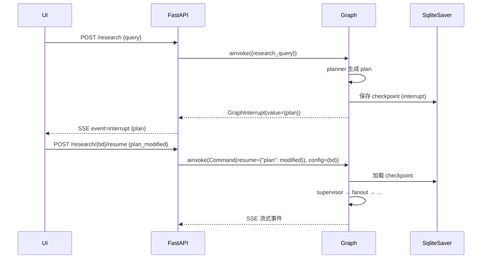
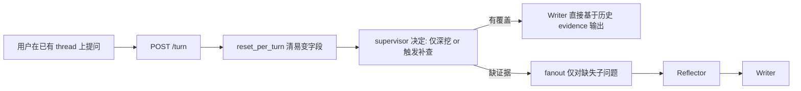
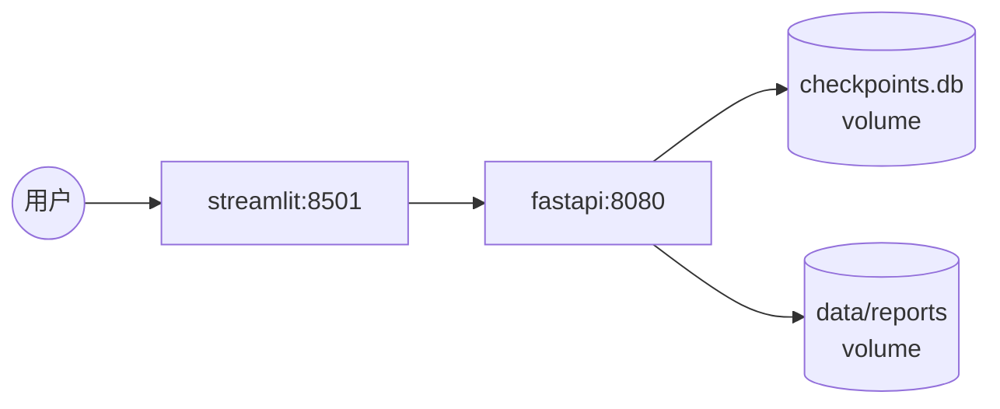

# InsightLoop 工程设计文档

> 配套 PRD：[`PROJECT_SCENARIO.md`](./PROJECT_SCENARIO.md)
> 文档定位：架构级设计 — 流程图 + 接口契约 + 关键签名，不堆砌完整实现代码
> 版本：v1.0 · 2026-04-18

---

## 一、文档定位

`PROJECT_SCENARIO.md` 回答"做什么 / 给谁用 / 验收什么"；本文档回答"**怎么落地为可运行的代码**"：

- 模块如何划分、依赖方向如何
- LangGraph 主图与子图如何拼装、节点之间靠哪些 state 字段通信
- HITL、并行 fan-out/in、流式推送等 LangGraph 高级特性的具体接线方式
- API、SSE 协议、持久化、错误降级、评测、部署的接口契约

阅读前置：先读 `PROJECT_SCENARIO.md` §三（流程）、§四（agent 分工）、§六（state）。

---

## 二、整体架构

### 2.1 分层架构

```mermaid
flowchart TB
    subgraph UI["前端层"]
        ST[Streamlit UI<br/>聊天 + 计划确认 + 报告预览]
    end
    subgraph API["接入层 (FastAPI)"]
        EP[/research<br/>research/{tid}/resume<br/>research/{tid}/stream/]
    end
    subgraph GRAPH["编排层 (LangGraph)"]
        SUP[Supervisor 路由]
        PLAN[Planner + interrupt]
        FANOUT[Send fan-out]
        SUB[Researcher 子图<br/>web / academic / code / kb]
        REF[Reflector 反思循环]
        WR[Writer]
    end
    subgraph TOOL["工具层 (统一 SearchTool 协议)"]
        direction TB
        T1[Tavily HTTP]
        T2[ArXiv HTTP]
        T3[GitHub HTTP]
        T4[KB Retriever<br/>复用 01_RAG]
        EXT[External MCP<br/>Brave / Filesystem]
        INT[Internal MCP Server<br/>暴露 KB/Report/Evidence]
    end
    subgraph DATA["数据层"]
        CKPT[(SQLite<br/>checkpointer)]
        REPORTS[(data/reports/)]
        CHROMA[(Chroma<br/>+ BM25)]
    end

    ST <--> EP
    EP --> GRAPH
    GRAPH --> TOOL
    GRAPH --> CKPT
    WR --> REPORTS
    T4 --> CHROMA
```

### 2.2 模块依赖（单向，禁止反向）

```
app/  ──▶  graph/  ──▶  agents/  ──▶  tools/  ──▶  rag/ (复用 01_RAG)
                  ▲                          │
                  └──── prompts/ ◀───────────┘
config/  ◀── 所有层只读取，不被任何模块反向依赖
```

- `app/` 只调 `graph.workflow.build_graph()`，不直接 import agents
- `agents/` 只调 `tools/` 与 `prompts/`，不感知 FastAPI / Streamlit
- `tools/` 不依赖 `agents/` 与 `graph/`，便于单测
- `rag/` 软引用 `01_RAG`：`tools/kb_retriever.py` 通过适配器封装 `ParentChildHybridRetriever`，上层只看到 `Evidence` 列表

---

## 三、LangGraph 主图设计

### 3.1 图结构



### 3.2 节点字段所有权矩阵

| 节点 | 读取 | 写入 | 副作用 |
|---|---|---|---|
| `planner` | `research_query`, `audience` | `plan`, `messages` | 触发 `interrupt` |
| `supervisor` | `plan_confirmed`, `evidence`, `revision_count` | `next_node`, `iteration` | — |
| `web_researcher` | `plan` (本路 SubQuestion) | `evidence` (reducer add) | Tavily/Brave HTTP |
| `academic_researcher` | 同上 | `evidence` | ArXiv HTTP |
| `code_researcher` | 同上 | `evidence` | GitHub HTTP |
| `kb_researcher` | 同上 | `evidence` | Chroma + BM25 检索 |
| `reflector` | `evidence`, `plan` | `coverage_by_subq`, `missing_aspects`, `revision_count` | — |
| `writer` | `evidence`, `plan`, `research_query` | `final_report`, `citations`, `messages` | 写文件 `data/reports/` |

> 字段并发安全：4 个 Researcher 并行时只写 `evidence`（reducer = `operator.add`），不会冲突。

### 3.3 路由表

```python
# graph/router.py
def supervisor_route(state: ResearchState) -> str:
    if not state.get("plan_confirmed"): return "planner"
    if state["iteration"] == 0:        return "fanout_researchers"
    if state.get("revision_count", 0) >= 3: return "writer"  # 兜底
    if state.get("next_node") == "reflector": return "reflector"
    return "writer"

def reflector_route(state: ResearchState) -> str:
    rc = state.get("revision_count", 0)
    if rc >= 3: return "writer"                   # 强制收敛
    action = state.get("next_action")
    return "supervisor" if action == "need_more_research" else "writer"
```

### 3.4 HITL 时序



---

## 四、并行 fan-out / fan-in

### 4.1 Send API 派发

```python
# graph/nodes_parallel.py
from langgraph.constants import Send

def fanout_researchers(state: ResearchState) -> list[Send]:
    """每个 SubQuestion × 每个 recommended_source = 一个并行任务"""
    sends = []
    router = {"web": "web_researcher", "academic": "academic_researcher",
              "code": "code_researcher", "kb": "kb_researcher"}
    for sq in state["plan"]:
        if sq.status == "done": continue
        for src in sq.recommended_sources:
            sends.append(Send(router[src], {"sub_question": sq, **shared_ctx(state)}))
    return sends
```

### 4.2 Evidence 聚合契约

```python
# state.py
evidence: Annotated[list[Evidence], operator.add]   # reducer: 列表拼接
```

- 并行节点各自 `return {"evidence": [...]}`，LangGraph 自动调用 `add` 合并
- 不允许任何节点用"覆写"方式写 `evidence`，否则会丢失并行结果

### 4.3 失败容错

```python
# agents/_safe.py
def safe_node(fn):
    @functools.wraps(fn)
    async def wrapper(state):
        try:
            return await fn(state)
        except Exception as e:
            logger.warning("node %s failed: %s", fn.__name__, e)
            return {"evidence": [], "messages": [AIMessage(f"[skip] {fn.__name__}: {e}")]}
    return wrapper
```

约束：单 sub-agent 失败 → 返回空 evidence + 警告消息，**不中断主图**。Reflector 据此可触发补查。

---

## 五、State 契约

State 类型见 `PROJECT_SCENARIO.md` §六。本节补充工程细节：

### 5.1 Reducer 选择

| 字段 | reducer | 理由 |
|---|---|---|
| `evidence` | `operator.add` | 并行节点累加，禁止覆写 |
| `messages` | `add_messages` | 自动按 id 去重 |
| `plan` / `final_report` / `citations` | 默认（覆写） | 单一写入者 |
| `revision_count` / `iteration` | 默认（覆写） | 由对应 node 负责自增 |
| `coverage_by_subq` | 默认（覆写） | 仅 reflector 写 |

### 5.2 跨 turn 复用规则

| 字段 | 多轮间策略 |
|---|---|
| `messages`, `evidence`, `plan` | **保留**（追问的事实基础） |
| `final_report`, `citations` | **保留**最近一次 |
| `revision_count`, `iteration`, `next_node`, `coverage_by_subq`, `missing_aspects` | **重置**（新一轮重新计算） |
| `research_query` | **覆写**为新一轮用户输入 |

每轮开始前由 `app/turn_init.py::reset_per_turn(state)` 统一处理。

---

## 六、Agent 接口契约

所有节点统一异步签名：

```python
NodeFn = Callable[[ResearchState], Awaitable[dict[str, Any]]]
```

### 6.1 接口表

| Agent | 输入字段 | 输出字段 | 工具 | 模型档位 |
|---|---|---|---|---|
| `planner_node` | `research_query`, `audience` | `plan`, `messages` | — | qwen-max |
| `supervisor_node` | `plan_confirmed`, `evidence`, `revision_count` | `next_node`, `iteration` | — | qwen-turbo |
| `web_researcher_node` | `sub_question` | `evidence` | Tavily / Brave | qwen-turbo |
| `academic_researcher_node` | `sub_question` | `evidence` | ArXiv | qwen-turbo |
| `code_researcher_node` | `sub_question` | `evidence` | GitHub | qwen-turbo |
| `kb_researcher_node` | `sub_question` | `evidence` | KB Retriever | qwen-turbo |
| `reflector_node` | `evidence`, `plan` | `coverage_by_subq`, `missing_aspects`, `next_action`, `revision_count` | — | qwen-max |
| `writer_node` | `evidence`, `plan`, `research_query` | `final_report`, `citations`, `messages` | — | qwen-max |

### 6.2 结构化输出模型（签名）

```python
# agents/schemas.py
class SubQuestion(BaseModel):
    id: str
    question: str
    recommended_sources: list[Literal["web","academic","code","kb"]]
    status: Literal["pending","researching","done"] = "pending"

class ResearchPlan(BaseModel):
    sub_questions: list[SubQuestion]
    estimated_depth: Literal["quick","standard","deep"]

class Evidence(BaseModel):
    sub_question_id: str
    source_type: Literal["web","academic","code","kb"]
    source_url: str
    snippet: str
    relevance_score: float
    fetched_at: str

class ReflectionResult(BaseModel):
    coverage_by_subq: dict[str, int]      # 0-100
    missing_aspects: list[str]
    next_action: Literal["sufficient","need_more_research","force_complete"]
    additional_queries: list[str] | None = None

class Citation(BaseModel):
    idx: int
    source_url: str
    title: str | None = None
```

所有 LLM 调用走 `llm.with_structured_output(Model)`，禁止手写 JSON 解析。

### 6.3 Planner 的 interrupt 触发点

```python
async def planner_node(state):
    plan = await (PROMPT | llm.with_structured_output(ResearchPlan)).ainvoke(...)
    user_decision = interrupt({"plan": plan.model_dump()})   # ⏸ 阻塞
    return {"plan": user_decision["plan"], "plan_confirmed": True}
```

### 6.4 Reflector 退出条件

- `next_action == "sufficient"` → writer
- `next_action == "force_complete"` → writer
- `revision_count >= 3` → writer（硬兜底，优先级最高）
- 否则 → supervisor 触发新一轮 fanout

---

## 七、Tool 层与 MCP 集成

Tool 层是 Agent 与外部世界的唯一接触面。设计目标：**统一协议 + 双向 MCP（既作 client 消费外部能力，也作 server 暴露内部能力）**。

### 7.1 统一工具协议

```python
# tools/base.py
class ToolResult(TypedDict):
    snippet: str
    source_url: str
    relevance_score: float
    extra: dict          # 保留原始字段，便于 writer 展示 metadata

class SearchTool(Protocol):
    name: str            # 用于日志 / LangSmith tag
    source_type: Literal["web","academic","code","kb"]
    async def search(self, query: str, *, top_k: int = 5) -> list[ToolResult]: ...
    async def close(self) -> None: ...        # 释放 HTTP client / MCP session
```

所有工具实现（HTTP / MCP / 本地）必须符合该协议。Researcher 节点只看到 `SearchTool`，工具替换、降级、A/B 测试都靠接口不靠 if/else。

### 7.2 工具注册中心

```python
# tools/registry.py
class ToolRegistry:
    def __init__(self): self._tools: dict[str, list[SearchTool]] = defaultdict(list)
    def register(self, tool: SearchTool): self._tools[tool.source_type].append(tool)
    def get_chain(self, source_type: str) -> list[SearchTool]:
        """返回该源的降级链：主工具 → 兜底工具 → ..."""
        return self._tools[source_type]

# 启动时（app/bootstrap.py）
registry = ToolRegistry()
registry.register(TavilyTool(cfg))
registry.register(await BraveMCPTool.connect(cfg))   # Tavily 的兜底
registry.register(ArxivTool(cfg))
registry.register(GitHubTool(cfg))
registry.register(KBRetriever(cfg))
```

Researcher 节点拿到 `registry.get_chain("web")`，按顺序尝试，前一个失败/限流就走下一个。

### 7.3 外部 MCP 接入（client 侧）

**用途**：作为现有 HTTP 工具的兜底 + 扩展。

```jsonc
// .mcp.json
{
  "mcpServers": {
    "brave-search": {
      "command": "npx",
      "args": ["-y", "@modelcontextprotocol/server-brave-search"],
      "env": {"BRAVE_API_KEY": "${BRAVE_API_KEY}"},
      "source_type": "web"        // 自定义字段，loader 据此注册到 registry
    },
    "filesystem": {
      "command": "npx",
      "args": ["-y", "@modelcontextprotocol/server-filesystem", "./data/reports"],
      "source_type": "fs"         // 非 Research 源,供 Writer 归档使用
    }
  }
}
```

```python
# tools/mcp_loader.py
class MCPClientAdapter(SearchTool):
    """把 MCP server 暴露的 tool 包装成 SearchTool"""
    def __init__(self, session: ClientSession, tool_name: str, source_type: str):
        self._session, self._tool, self.source_type = session, tool_name, source_type
        self.name = f"mcp:{tool_name}"

    async def search(self, query, *, top_k=5):
        res = await self._session.call_tool(self._tool, {"query": query, "count": top_k})
        return [_normalize(item) for item in res.content]

async def load_external_mcp(config_path=".mcp.json") -> list[SearchTool]:
    """进程启动时连接所有 external MCP server,返回 SearchTool 列表"""
```

生命周期：FastAPI `lifespan` 中 `await load_external_mcp()` → 注册到 registry → `app.state.mcp_sessions` 持有 ClientSession 引用，停机时统一 close。

### 7.4 内部 MCP Server（server 侧，自建）

**目标**：把 InsightLoop 的内部能力（KB 检索、报告读取、证据查询）以 MCP 协议暴露出来，让 Claude Desktop / Cursor / 其他 agent 能直接调用本项目的能力。

**暴露的 tools**：

| Tool 名 | 入参 | 返回 | 用途 |
|---|---|---|---|
| `kb_search` | `{query: str, top_k: int=5}` | `list[ToolResult]` | 复用 `ParentChildHybridRetriever` 做混合检索 |
| `list_reports` | `{limit: int=20}` | `list[{tid, query, path, created_at}]` | 列出历史报告 |
| `read_report` | `{thread_id: str}` | `{content: str, citations: list}` | 读取某次研究报告 |
| `list_evidence` | `{thread_id: str, sub_question_id?: str}` | `list[Evidence]` | 查询某会话已收集证据 |
| `trigger_research` | `{query: str, audience?: str}` | `{thread_id: str}` | 触发新研究（异步，返回 tid 供轮询） |

**实现骨架**：

```python
# tools/internal_mcp/server.py
from mcp.server import Server
from mcp.server.stdio import stdio_server
from mcp.types import Tool, TextContent

app = Server("insightloop-internal")

@app.list_tools()
async def _list() -> list[Tool]:
    return [
        Tool(name="kb_search", description="...", inputSchema={...}),
        Tool(name="list_reports", description="...", inputSchema={...}),
        # ...
    ]

@app.call_tool()
async def _call(name: str, arguments: dict) -> list[TextContent]:
    match name:
        case "kb_search":
            docs = await kb_retriever.search(arguments["query"], top_k=arguments.get("top_k", 5))
            return [TextContent(type="text", text=json.dumps(docs))]
        case "list_reports":
            return [TextContent(type="text", text=json.dumps(report_store.list(**arguments)))]
        # ...

async def main():
    async with stdio_server() as (read, write):
        await app.run(read, write, app.create_initialization_options())
```

**启动方式**：

- **stdio 模式**：独立进程 `python -m tools.internal_mcp.server`，供 Claude Desktop / Cursor 在其 `claude_desktop_config.json` 里配置启动。
- **HTTP/SSE 模式**（可选）：挂载到 FastAPI 同进程 `app.mount("/mcp", mcp_sse_app)`，便于远程客户端接入。

**依赖隔离**：Internal MCP server 直接 `from rag.retriever import ParentChildHybridRetriever`、`from app.report_store import ReportStore` 复用代码，**但不加载 LangGraph 图**（避免启动时跑起整条 pipeline）。它是一个轻量的只读/少写服务。

**对项目自身的价值**：

1. **对外输出**：面试展示时 Claude Desktop 可以直接调本项目 KB，证明"本项目 = 可复用基础设施"而非封闭 Demo。
2. **dogfooding**：在 `agents/researcher_kb.py` 中同时支持"直接调 `KBRetriever`"和"走 internal MCP"两种路径，通过 `config.USE_INTERNAL_MCP_FOR_KB` 切换，便于验证 MCP 协议健壮性。
3. **统一治理**：所有内部能力对外都经过同一张 MCP 合约表，schema 变更能被静态检查。

### 7.5 KB Retriever 适配器

```python
# tools/kb_retriever.py
from rag.retriever import ParentChildHybridRetriever

class KBRetriever(SearchTool):
    name, source_type = "kb_hybrid", "kb"
    def __init__(self, cfg): self._impl = ParentChildHybridRetriever(cfg)
    async def search(self, query, *, top_k=5) -> list[ToolResult]:
        docs = await asyncio.to_thread(self._impl.retrieve, query, top_k)
        return [_to_tool_result(d) for d in docs]
    async def close(self): ...
```

复用方式：`01_RAG/rag/` 通过 `PYTHONPATH` 或 `pyproject.toml` 的 `packages` 字段暴露为可 import 包。**只复用代码，不复用文档**。

### 7.6 启动顺序

```
FastAPI lifespan
  ├─ 1. load settings / .env
  ├─ 2. init LLM clients (DashScope)
  ├─ 3. init KBRetriever (连 Chroma + BM25)
  ├─ 4. load_external_mcp() → 连 Brave / FS
  ├─ 5. ToolRegistry.register(*all_tools)
  ├─ 6. build_graph(checkpointer=SqliteSaver)
  └─ 7. (可选) 启动 internal MCP server 子进程或挂载 SSE route
```

停机顺序反之：先停图运行 → 关 MCP session → 关 HTTP client → 关 DB。

---

## 八、API 与流式协议

### 8.1 路由表

| 方法 | 路径 | 用途 | Body / Resp |
|---|---|---|---|
| POST | `/research` | 启动新会话 | `StartReq` → `{thread_id}` |
| POST | `/research/{tid}/resume` | HITL 恢复 | `ResumeReq` → `{ok}` |
| POST | `/research/{tid}/turn` | 同会话追问 | `TurnReq` → `{ok}` |
| GET  | `/research/{tid}/stream` | SSE 实时事件 | `text/event-stream` |
| GET  | `/threads` | 历史会话列表 | `list[ThreadInfo]` |
| GET  | `/threads/{tid}` | 单会话详情 | `ThreadDetail` |

### 8.2 Pydantic Schema（签名）

```python
# app/schemas.py
class StartReq(BaseModel):
    research_query: str
    audience: str = "intermediate"
    depth: Literal["quick","standard","deep"] = "standard"

class ResumeReq(BaseModel):
    plan: ResearchPlan          # 用户编辑后的计划

class TurnReq(BaseModel):
    research_query: str         # 追问内容

class ThreadInfo(BaseModel):
    thread_id: str
    created_at: str
    last_query: str
    turn_count: int
```

### 8.3 SSE 事件协议

```
event: node_enter
data: {"node":"planner","ts":"..."}

event: node_exit
data: {"node":"planner","ts":"...","duration_ms":1234}

event: tool_call
data: {"node":"web_researcher","tool":"tavily","query":"..."}

event: interrupt
data: {"value":{"plan":{...}}}

event: token
data: {"node":"writer","delta":"..."}

event: final
data: {"final_report":"...","citations":[...]}

event: error
data: {"node":"...","message":"..."}
```

### 8.4 astream_events → SSE 转换契约

```python
async for ev in graph.astream_events(input, config, version="v2"):
    match ev["event"]:
        case "on_chain_start":   yield sse("node_enter", {"node": ev["name"]})
        case "on_chain_end":     yield sse("node_exit",  {"node": ev["name"]})
        case "on_tool_start":    yield sse("tool_call",  {...})
        case "on_chat_model_stream" if ev["name"] == "writer": yield sse("token", ...)
```

GraphInterrupt 由外层 try/except 捕获后单独发 `event: interrupt`。

---

## 九、持久化与多轮会话

### 9.1 Checkpointer

```python
# graph/workflow.py
checkpointer = SqliteSaver.from_conn_string("data/checkpoints.sqlite")
graph = workflow.compile(checkpointer=checkpointer)
```

- `thread_id` 由后端生成（`uuid4().hex[:12]`），返给前端持有
- 同 `thread_id` 重入 → LangGraph 自动加载 state，无需手动 merge

### 9.2 报告归档

```
data/reports/{YYYYMMDD-HHMMSS}_{slug(query, 40)}_{tid}.md
```

Writer 节点写完 state 后，再以 side-effect 落盘；文件路径写入 `state["report_path"]`，便于 UI 提供下载。

### 9.3 多轮追问流程



---

## 十、可观测性

### 10.1 LangSmith Tag

| 维度 | Tag 格式 | 示例 |
|---|---|---|
| Agent | `agent:<name>` | `agent:planner` |
| 会话 | `thread:<tid>` | `thread:a3f1c2` |
| 轮次 | `turn:<n>` | `turn:2` |
| 模型档位 | `model:<tier>` | `model:qwen-max` |

`config/tracing.py::with_tags(node_fn, name)` 装饰器统一注入。

### 10.2 日志

- 结构化字段：`thread_id`, `turn`, `node`, `iteration`, `tool`, `latency_ms`
- 级别：INFO（节点进出 / 工具调用）/ WARN（降级 / 重试）/ ERROR（节点级失败）
- 输出：stdout（JSON line），便于 Docker 收集

---

## 十一、错误处理与降级

### 11.1 节点级包装

见 §4.3 `safe_node` 装饰器。所有 Researcher 节点必须套用。

### 11.2 工具降级链

```
Web   : Tavily ──(timeout/429)──▶ MCP Brave ──(失败)──▶ 跳过 + WARN
Acad  : ArXiv  ──(失败)──▶ 跳过
Code  : GitHub ──(rate limit)──▶ 退避重试 1 次 ──▶ 跳过
KB    : Chroma 不可用 ──▶ 跳过（不阻塞主流程）
```

### 11.3 LLM 结构化输出失败

- 第 1 次解析失败：把错误回灌进 prompt，让模型自纠（最多 1 次）
- 仍失败：节点 raise → `safe_node` 兜底
- Planner 例外：解析失败必须中断流程并返回 5xx，避免用户基于空计划确认

---

## 十二、评测体系

### 12.1 模块结构

```
evals/
├── dataset.jsonl         # 20 题 × {query, expected_aspects, audience}
├── judge.py              # LLM-as-judge prompt + 调用
├── run_eval.py           # 跑全集，输出 reports/eval_<ts>.md
└── fixtures/             # 离线工具响应（避免外网依赖）
```

### 12.2 评分维度

| 维度 | 权重 | judge prompt 要点 |
|---|---|---|
| 覆盖度 | 40% | expected_aspects 中被命中的比例 |
| 准确性 | 30% | 引用与论点对应、无明显事实错误 |
| 引用质量 | 30% | 引用数 ≥ 5、URL 可解析、来源多样性 |

### 12.3 入口

```bash
make eval        # 20 题全集
make eval-smoke  # 1 题冒烟
```

输出 markdown 报告：每题分项分 + 总分 + diff 上一次基线。

---

## 十三、部署架构

### 13.1 Compose 服务图



M6 Compose 仅打包 `03_MULTI_AGENT` 的 API + UI。`01_RAG` 不挂入容器；KB 检索源缺失时按现有降级逻辑返空。

### 13.2 环境变量分类

| 类别 | 变量 | 必填 |
|---|---|---|
| LLM | `DEEPSEEK_API_KEY` | ✅ |
| 搜索 | `DASHSCOPE_API_KEY` | ✅（DashScope 搜索兜底） |
| 工具 | `TAVILY_API_KEY`, `GITHUB_TOKEN`, `BRAVE_API_KEY` | ✅ / ✅ / 可选 |
| 追踪 | `LANGCHAIN_TRACING_V2`, `LANGCHAIN_API_KEY`, `LANGCHAIN_PROJECT` | 可选 |
| 应用 | `CHECKPOINTER_DB`, `REPORTS_DIR`, `MAX_REFLECTION_ITERATIONS`, `INSIGHTLOOP_API` | 默认值 |

`.env.example` 列出所有键 + 注释 + 示例值，Docker 通过 `env_file:` 注入。

---

## 十四、开发里程碑

| 里程碑 | 范围 | 完成判定 |
|---|---|---|
| **M1 骨架** | State + 主图空节点 + SqliteSaver | `pytest tests/test_graph_skeleton.py` 通过；图能从 entry 跑到 END |
| **M2 HITL** | Planner + interrupt + 单 web_researcher + 串行 writer | CLI 跑通"提问→暂停→resume→出报告"完整链路 |
| **M3 并行** | fanout + 4 个 Researcher + Reflector + 循环兜底 | `evidence` 来自 ≥ 2 源；`revision_count` 上限生效 |
| **M4 报告** | Writer 引用脚注 + 文件归档 | 报告 Markdown ≥ 1500 字、≥ 5 条引用 |
| **M5 接入** | FastAPI + SSE + Streamlit + 多轮追问 + 外部 MCP 接入 | 浏览器能完成 turn1→turn2 全流程；Brave MCP 兜底生效 |
| **M5.5 内部 MCP** | `tools/internal_mcp/server.py` 暴露 `kb_search` / `list_reports` / `read_report` / `list_evidence` / `trigger_research` | Claude Desktop 配置后可直接调用本项目 KB 与历史报告；`USE_INTERNAL_MCP_FOR_KB` 切换走通 |
| **M6 生产化** | 评测集 + Docker Compose + LangSmith tag | `docker compose up` 5 分钟内可用；`make eval` 平均分 ≥ 80 |

每个里程碑 = 一个 PR，CI 必须通过。

---

## 十五、与 PROJECT_SCENARIO 需求映射

| PRD 需求 | 本文档章节 |
|---|---|
| F01 提问 + 深度选择 | §八 `StartReq` |
| F02 计划暂停 / 编辑 / 中止 | §三 3.4 HITL 时序、§六 6.3 |
| F03 并行派发 + 实时状态 | §四、§八 8.3 SSE |
| F04 反思补查 + 3 轮兜底 | §三 3.3 路由、§六 6.4 |
| F05 Markdown 报告 + 导出 | §九 9.2 |
| F06 多轮追问复用 evidence | §五 5.2、§九 9.3 |
| F07 报告归档 | §九 9.2 |
| F08 SSE 流式 | §八 8.3 / 8.4 |
| F09 SqliteSaver 持久化 | §九 9.1 |
| F10 thread_id 隔离 + 历史 | §八 8.1、§九 9.1 |
| F11 节点级错误捕获 | §四 4.3、§十一 |
| F12 Docker Compose | §十三 |
| F13 LangSmith trace | §十 |
| F14-F16 评测集 / judge / make eval | §十二 |

---

## 附：模块目录补充

在 `PROJECT_SCENARIO.md` §八的基础上，`tools/` 子目录扩充如下：

```
tools/
├── base.py                 # SearchTool Protocol + ToolResult
├── registry.py             # ToolRegistry（降级链管理）
├── tavily_tool.py
├── arxiv_tool.py
├── github_tool.py
├── kb_retriever.py         # 复用 01_RAG
├── mcp_loader.py           # 外部 MCP client 加载器
└── internal_mcp/
    ├── __init__.py
    ├── server.py           # 自建 MCP server 入口（stdio + 可选 SSE）
    ├── schemas.py          # 工具 inputSchema 定义
    └── handlers.py         # kb_search / list_reports / ... 实现
```

本文档所述模块与 `PROJECT_SCENARIO.md` §八目录结构在一级目录上保持一致；如需变更须同步更新两份文档。
